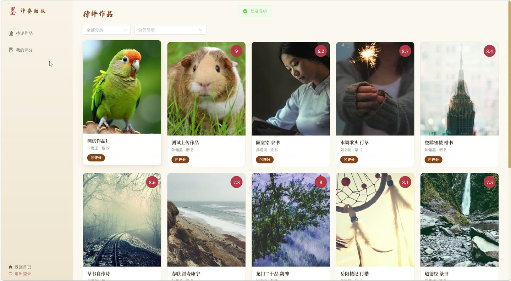
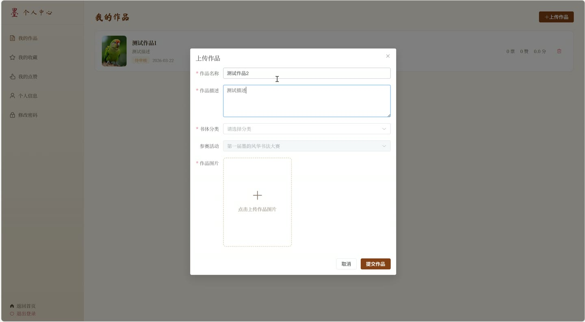

# (附文档)Springboot2+Vue3+MySQL 在线书法作品展示与评分投票系统

**技术栈**：Springboot2、Vue3、MySQL

### 系统简介

本项目是一套基于 Spring Boot 2 + Vue 3 + MySQL 构建的在线书法作品展示与评分投票系统。系统采用前后端分离架构，支持普通用户、评委、管理员三种角色。普通用户可以上传书法作品、浏览画廊、参与投票和点赞收藏；评委可以对作品进行专业评分；管理员负责审核作品、管理用户、分类和活动。系统提供了完整的作品展示、互动评分、数据统计等功能。
 
### 核心功能
 
### 普通用户端

 
- 注册与登录：使用用户名和密码注册新账号，登录后获取 JWT Token 用于后续请求。 
- 浏览作品画廊：查看已审核通过的作品列表，支持按分类、活动、关键词筛选。 
- 查看作品详情：点击作品进入详情页，查看作品图片、描述、作者信息、分类和所属活动。 
- 投票支持作品：对喜欢的作品进行投票（支持取消投票），投票数实时更新。 
- 点赞作品：对作品进行点赞操作（支持取消点赞），点赞数实时更新。 
- 收藏作品：将作品加入个人收藏夹（支持取消收藏），收藏数实时更新。 
- 评论作品：在作品详情页发表评论，评论内容包含用户昵称和头像。 
- 管理个人作品：在个人中心查看自己提交的所有作品，支持新增、编辑、删除操作。 
- 查看我的收藏/点赞：在个人中心查看我收藏和点赞过的作品列表。 
- 修改个人资料：更新昵称、头像、邮箱、手机号、个人简介等信息。 
- 修改密码：输入原密码和新密码，完成密码修改。 
- 浏览活动列表：查看所有书法活动，包括活动名称、描述、状态和时间。 
- 查看排行榜：按投票数或评分排序查看作品排行，支持按活动筛选。
 
### 评委端

 
- 待评分作品列表：查看尚未评分的作品列表（已评分的作品自动排除），支持按分类和活动筛选。 
- 提交评分：对作品进行打分（数值型分数），并可附加评语。 
- 修改评分：对已评分的作品可以修改分数和评语。 
- 查看我的评分记录：查看自己所有已评分的作品列表，包含分数和评语。 
- 查看作品详情：点击作品查看完整信息和当前平均分。 
- 收藏/点赞作品：评委也可以对作品进行收藏和点赞操作。
 
### 管理员端

 
- 仪表盘统计：查看系统总作品数、待审核作品数、已通过作品数、总用户数、评委数、分类数、活动数、总投票数等统计指标。 
- 作品审核管理：查看所有作品列表，支持按审核状态和关键词筛选，对作品进行审核通过/驳回操作并填写审核备注。 
- 删除作品：对违规作品进行删除操作。 
- 用户管理：查看所有用户列表，支持按角色筛选，查看用户详情。 
- 用户状态管理：启用或禁用用户账号，禁用后用户无法登录。 
- 用户角色管理：将普通用户升级为评委角色，或将评委降级为普通用户。 
- 用户审核管理：对注册评委的用户进行审核通过或驳回操作。 
- 删除用户：删除非管理员用户账号。 
- 分类管理：新增、编辑、删除作品分类，支持设置分类名称、描述和排序顺序。 
- 活动管理：创建、编辑、删除书法活动，支持设置活动名称、描述、状态、开始时间和结束时间。
 
### 技术栈

  后端框架 Spring Boot 2.x   ORM 框架 MyBatis-Plus   权限认证 JWT（JSON Web Token）   前端框架 Vue 3（Composition API + script setup）   前端路由 Vue Router 4（History 模式）   UI 组件库 Element Plus   构建工具 Vite   数据库 MySQL 8.x   文件上传 Spring MultipartFile   密码加密 MD5（Hutool）   JSON 处理 Jackson + JavaTimeModule 
 
### 交付内容

 
- 后端完整源码 
- 前端完整源码 
- 数据库初始化脚本 
- 万字文档

## 界面展示

---

## 获取完整源码 + 万字文档

本仓库为项目介绍页。**完整前后端源码、数据库初始化脚本、万字项目文档**，请加微信 `kangkangcode`，或访问 [codekk.top](http://codekk.top) 获取。

可作课程设计 / 毕业设计参考，支持远程部署调试。